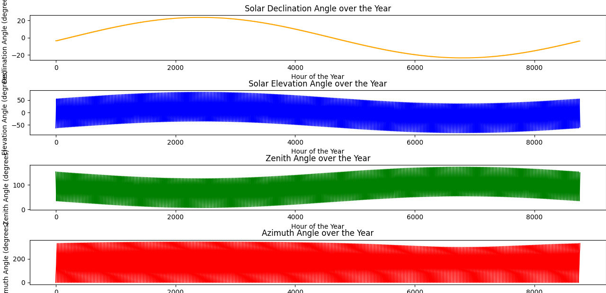

# Solar Angle Computation and Tilt Optimization Project

## Project Overview
This project is focused on computing solar angles (declination, elevation, zenith, and azimuth) and optimizing the tilt angle for solar panels based on the geographical location of Faisalabad, Pakistan (latitude: 31.4605). The computations provide insights into solar energy potential throughout the year and the ideal tilt for maximum energy efficiency.

## Features
1. **Solar Angle Calculations**:
   - **Solar Declination Angle**: Computed for each day of the year.
   - **Solar Elevation Angle**: Shows the sun's height above the horizon.
   - **Zenith Angle**: The angle between the sun and the vertical.
   - **Azimuth Angle**: Direction of the sun relative to the observer.

2. **Tilt Optimization**:
   - Determines the optimal tilt angle for solar panels to maximize energy efficiency.
   - Graphical representation of energy vs. tilt angle, highlighting the best angle.

3. **Visualization**:
   - Clear graphs to visualize the variation of solar angles over the year.
   - Detailed plots for understanding the influence of tilt on energy output.

## Files in the Repository
- **`compute.py`**: Python script containing all the computations and plotting logic.
- **`Optimum Tilt fsd.png`**: Plot illustrating the energy output for various tilt angles and highlighting the optimal tilt.
- **`Figure_1.png`**: Multi-plot showing solar angles (declination, elevation, zenith, azimuth) over the year.

## Requirements
To run the project, ensure you have the following installed:
- Python 3.x
- Required libraries: `matplotlib`, `math`

Install the dependencies using:
```bash
pip install matplotlib
```

## How to Use
1. Clone this repository:
   ```bash
   git clone https://github.com/itsAhadun/SolarOptimalAngel.git
   cd SolarOptimalAngel
   ```
2. Run the `compute.py` script:
   ```bash
   python compute.py
   ```
3. The script will generate and display the plots:
   - Solar angles over the year.
   - Optimal tilt angle for solar panels.

## Key Results
- **Optimal Tilt**: The best tilt angle for Faisalabad was found to be approximately **31.4504 degrees**, as shown in the plot.
- **Annual Solar Data**: Visualized changes in solar angles across the year for better planning and implementation.

## Applications
- Solar energy optimization for specific locations.
- Enhancing efficiency of solar panel installations.
- Research and development in renewable energy.

## Example Outputs
### Optimal Tilt Plot


### Solar Angles Over the Year


## Contributions
Feel free to contribute by:
- Reporting bugs or suggesting features.
- Forking the repository and submitting pull requests.

## License
This project is licensed under the MIT License. See the `LICENSE` file for details.
